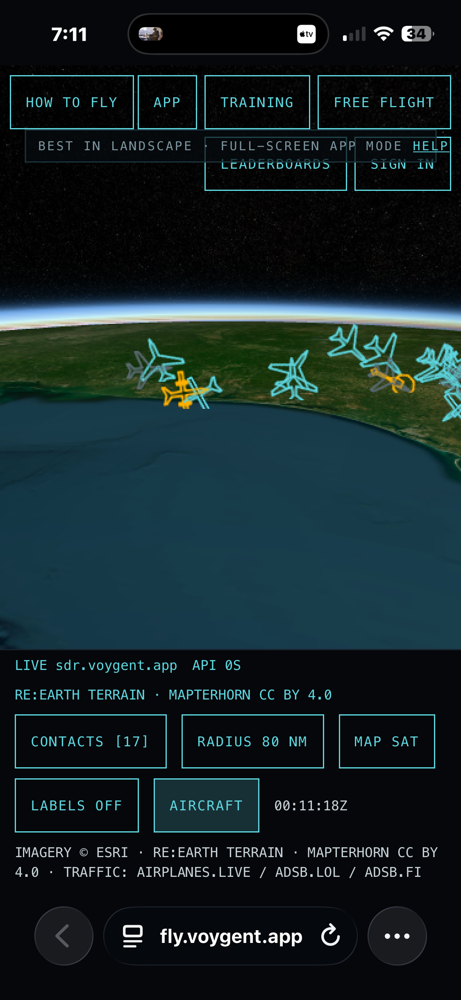
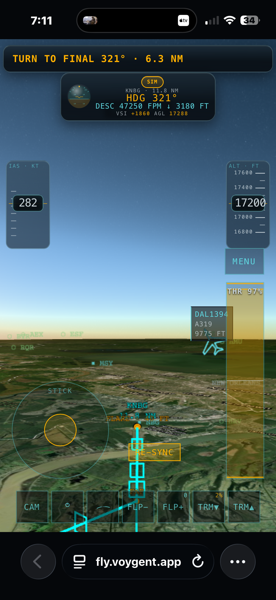
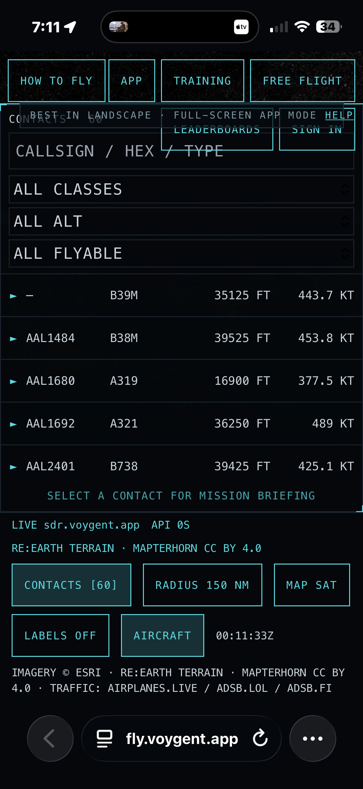
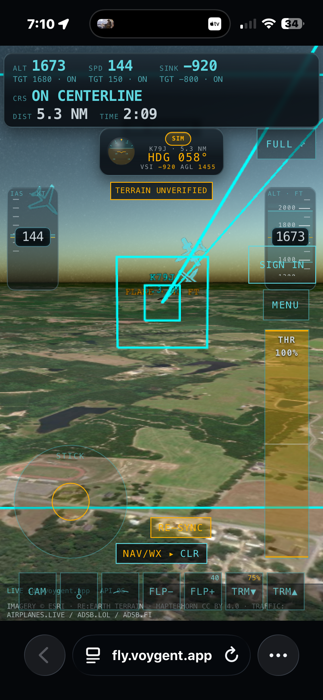
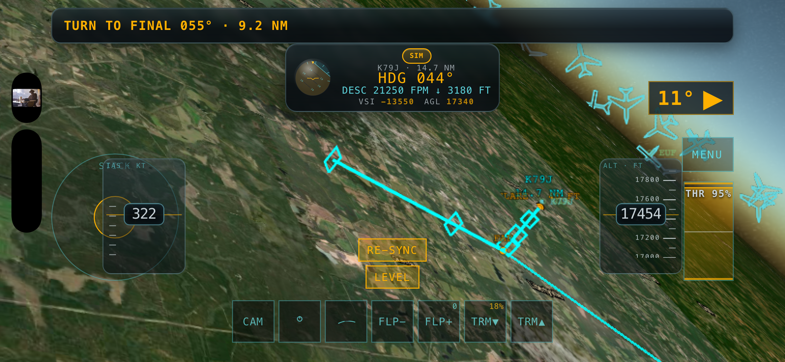

# SQUAWK

Pick a real aircraft off live ADS-B, take the controls, and fly it first-person over real
satellite imagery and real terrain — until you crash, land, or quit. The real aircraft
keeps flying on the feed as a ghost while yours diverges.

Browser-based (CesiumJS), self-hosted, single-user, MIT. Sibling of
[LORAN](https://github.com/iamneilroberts/LORAN).

Pick a real contact off the live browse globe, TAKE CONTROLS, and fly it first-person over
real Esri imagery and real Re:Earth terrain until you land, crash, or quit. Its real ICAO
type decides how it flies — a Cessna handles nothing like a 737 or an F-5. Design spec:
[`docs/superpowers/specs/2026-07-27-adsb-game-design.md`](docs/superpowers/specs/2026-07-27-adsb-game-design.md).

## What it is

- **Browse** — a minimal live ADS-B display around a home location (backend-proxied,
  rate-limited, honest empty states — feeds down shows offline, unknown fields render `—`).
- **Take controls** — snapshot a real contact's position/altitude/heading/speed. Its real
  ICAO type maps to one of **eight flight-model classes**: GA piston (C172), airliner (737-800),
  business jet, turboprop, warbird (T-6), C-130, fighter (F-5), and helicopter (R44). A contact
  with a missing or unrecognized type stays browsable but can't be flown.
- **Fly** — simplified 6-DOF physics where class character emerges from parameters (a 737
  rolls like 79 tonnes; a 172 stalls soft and mushy; the fighter has afterburner; the R44 is a
  rotorcraft). Approach guidance (PAPI, a flight director, final-approach fixes) and a landing
  score help you put it down.
- **End** — terrain contact anywhere on Earth, or a building inside a ~25 km bubble, ends the
  session with a stats card. Gentle, level, slow touchdowns read LANDED.

## Features

**Flight model & physics**
- Fixed-step 6-DOF simulation — SI units internally, aviation units only at the display edge,
  attitude as a quaternion — in a pure `sim/` core with no rendering dependencies and per-class
  envelope unit tests.
- Eight aircraft classes as *data, not code branches*: GA piston, airliner, business jet,
  turboprop, warbird (T-6), C-130, fighter (with afterburner), and helicopter (rotor forces).
- Modeled gear, flaps, and trim; per-class stall, Vno/Vfe, roll inertia, and thrust.

**Controls**
- Keyboard, a desktop click-drag **mouse flight-stick** (scroll-wheel throttle), and on-screen
  **touch controls** on mobile — one shared analog input model.
- **Auto-coordinated turns** (auto-rudder when the rudder is idle; manual rudder overrides), so a
  turn stays in balance without pedal work.

**World & scenery**
- A **3D globe** browse interface (CesiumJS) — pick a contact to select it, adjustable feed
  radius (range), and a satellite or chart basemap.
- Real **Esri** satellite imagery plus a lighter vector "chart" basemap — keyless.
- Real **Re:Earth** quantized-mesh terrain (ellipsoidal), with an honest flat fallback.
- **Time-aware day/night lighting** from the real sun position.
- Vector coastlines + state borders (**Natural Earth**) and airport/place labels (**OurAirports**).
- Buildings around the aircraft (Overture/OSM) for structure collision inside a ~25 km bubble.

**Guidance & landing**
- Approach guidance: **PAPI**, a flight **director**, final-approach-fix routing, and turn-to-final cues.
- Descent/approach speed & altitude bands with live readouts.
- **Landing scoring** with safety checks and evidence — gentle, level, on-speed touchdowns read LANDED.

**Instruments & HUD**
- First-person HUD with IAS/ALT tapes, heading, VSI, throttle, and a persistent **SIM** banner.
- A collapsible cockpit dashboard: analog **six-pack**, a **PPI radar scope** of the live feed, and a
  **nav map** with an optional **RainViewer** precip overlay.
- **Chase / exterior camera** in addition to the cockpit view.

**Live data & resilience**
- **No API keys required** to run — ADS-B, imagery, terrain, weather, borders, and place data are
  all keyless. Optional keys only unlock extras (Cesium-ion terrain fallback, AIS, and the hosted
  build's accounts/email).
- Live **ADS-B** aircraft with automatic **feed failover** (airplanes.live → adsb.lol → adsb.fi), a
  per-provider **circuit breaker**, courtesy rate-limiting, and honest offline states.
- **Bring your own receiver** — point the primary feed at your own ADS-B / SDR box.
- A **weather map** — RainViewer precip radar overlay on the nav map — plus nearest-station **METAR**.
- adsbdb type enrichment; optional **AIS** ship tracking (aisstream) as a parallel layer — see below.

**Session**
- The real aircraft you took over keeps flying on the feed as a **ghost** while yours diverges.
- Browse-time **mission briefing** with alternative airports and a route preview.
- **Free-flight** mode; an end-of-flight **stats / debrief** card; a saved **player profile** with a
  results history.
- A built-in **tutorial** with lessons and progress tracking; declutter and full-screen modes.

**Platform**
- Self-hosted, single-user, MIT. Installable **PWA** (full-screen standalone) with an offline result
  queue. An optional hosted "full product" build adds accounts, missions, and leaderboards.

## Desktop & mobile

SQUAWK runs in any WebGL browser. On **desktop** you fly with the keyboard or a click-drag
mouse stick (scroll-wheel throttle) and get the full analog instrument panel. On a **phone or
tablet** the layout switches to a touch-first rich HUD with on-screen controls that appear
only while flying — best in landscape.

**On mobile:**

| Browse | Cockpit |
|---|---|
|  |  |
|  |  |



_Desktop screenshots to come — drop PNGs at `docs/screenshots/desktop-browse.png` and `desktop-cockpit.png`._

### Full screen on mobile

The touch UI is best with the browser chrome out of the way. SQUAWK ships a web-app manifest,
so you can install it to your home screen and launch it full-screen (standalone):

- **iOS (Safari):** open the site → tap **Share** → **Add to Home Screen** → launch SQUAWK from
  the new home-screen icon. It opens full-screen with no Safari bars. Rotate to **landscape** for
  the full cockpit.
- **Android (Chrome):** open the site → tap the **⋮** menu → **Install app** (or **Add to Home
  screen**) → launch it from the icon for a full-screen standalone window.

The in-app hint bar flags this too ("FULL-SCREEN APP MODE · BEST IN LANDSCAPE").

## Install

SQUAWK runs three ways. Local and Docker are the turnkey single-user game (keyless, no
accounts). The Cloudflare Worker is the full product (accounts, missions, leaderboards)
and needs a Cloudflare account + guided setup.

### 1. Local (bare-metal dev)

Copy `.env.example` to `.env` first (no secrets required, every upstream feed is keyless).
One script runs the backend (uvicorn, from `backend/.venv`) and the Vite dev server
together, on **http://localhost:5173** (backend on `:8020`). Requires `python3` and
`node`/`npm` on `PATH`. First run creates `backend/.venv` and installs
`backend/requirements.txt`, and runs `npm ci` in `frontend/` — that's normal and only
happens once; later runs skip straight to starting the servers:

```bash
bash scripts/dev.sh
```

Single-user: browse + fly; no accounts. Port overrides: `scripts/dev.sh` passes
`ADSB_GAME_PORT` to uvicorn and `vite.config.ts` proxies to it. Running
`cd frontend && npm run dev` directly (bypassing `dev.sh`) leaves `ADSB_GAME_PORT` unset
and the Vite proxy falls back to `:8020`.

### 2. Docker

Copy `.env.example` to `.env` first (no secrets required, every upstream feed is keyless).

```bash
docker compose up --build
```

Frontend at **http://localhost:8021** (nginx, serving the built SPA and proxying `/api` to
the backend container on `:8020`) — ports are fixed in `docker-compose.yml` and
`nginx.conf`, not overridable via `ADSB_GAME_PORT` (see
[`docs/decisions.md` G-006](docs/decisions.md) — `:8010`/`:8080` are taken by other
services on the reference box). Single-user: browse + fly; no accounts.

### 3. Cloudflare Worker (full product)

1. `wrangler d1 create squawk-production` → put the id in your `wrangler.prod.jsonc`.
2. Apply migrations: `wrangler d1 migrations apply` against your new DB.
3. Create a Cloudflare Access application → note the team domain + AUD
   (`ACCESS_TEAM_DOMAIN`, `ACCESS_AUD`).
4. Create a Turnstile widget → site key (config) + secret key (`.dev.vars`).
5. Configure email sending (a verified sender) → `AUTH_FROM_EMAIL` / `ALERT_FROM_EMAIL`.
6. Create an Analytics Engine dataset → `REQUEST_ANALYTICS_DATASET`.
7. `cp frontend/wrangler.prod.example.jsonc frontend/wrangler.prod.jsonc`, then fill every
   `<PUT_YOUR_...>` and `your-domain.example` value.
8. Set each secret from `frontend/.dev.vars.example` via `wrangler secret put <NAME>`.
9. `cd frontend && npm run deploy:production`.

## Controls

Keyboard is the primary desktop control; the FPV view also takes a click-drag mouse
flight-stick with scroll-wheel throttle, and on a phone/tablet on-screen touch controls
appear while flying. The table below is the desktop keyboard set.

| Key | Action |
|---|---|
| `↑` / `↓` | pitch down / pitch up |
| `←` / `→` | roll left / roll right |
| `A` / `D` | rudder left / right |
| `W` / `S` (or `+` / `-`) | throttle up / down |
| `F` / `V` | flaps down / up (0 · 10 · 20 · 30) |
| `,` / `.` | trim nose down / nose up |
| `G` | gear up / down — fixed-gear types (e.g. the C172) read GEAR FIXED |
| `Esc` | pause (RESUME / QUIT TO BROWSE) |

Any contact whose real ICAO type is recognized can be taken over; the type maps to one of the
eight flight-model classes (see `frontend/src/takeover/eligibility.ts`) — fighter → F-5,
airliner → 737-800, plus business jet, turboprop, warbird (T-6), C-130, helicopter (R44), and
GA piston (C172). **Military is not itself a refusal** — a military fast-jet flies the fighter
model. A contact with a missing or unrecognized type, or a position fix older than 15 s, stays
browsable but can't start a mission, and the disabled TAKE CONTROLS button names the gate it
failed. The handoff card discloses the real-type → model mapping and every clamp the sim
applies to the snapshot before you fly.

### Map layers

Two toggles live in the status bar, beside the feed-radius chip:

- **MAP SAT / MAP CHART** — swaps the imagery layer between Esri World Imagery (satellite) and
  Esri Dark Gray Canvas (a much lighter vector-style basemap). Terrain, camera and traffic are
  untouched; only the imagery changes. Use CHART if tiles are slow.
- **LABELS ON / OFF** — adds Esri's keyless "World Boundaries and Places" reference layer plus
  airport idents from a bundled OurAirports extract. Off by default.

Both are keyless Esri REST services; the app still runs with `Ion.defaultAccessToken = null`.
The attribution line in the status bar and on the HUD names exactly the layers that are on.

**Refreshing the airport data** (rarely needed — it is committed):

```bash
bash scripts/fetch-ourairports.sh
```

That downloads OurAirports' public-domain `airports.csv`, keeps large and medium airports, and
rewrites `frontend/src/data/airports-world.json`. It is a build-time-only script: the browser
never fetches it and never parses CSV. The current extract holds 5,272 airports at 512 KB.

### The cockpit dashboard

While flying, a collapsible strip along the bottom of the screen carries:

- **INSTRUMENTS** — an analog six-pack (ASI, attitude, altimeter, turn coordinator, DG, VSI) drawn
  from the same ~10 Hz snapshot as the HUD, so the needles and the numbers can never disagree. The
  ASI's arcs are computed from the C172S parameter file: the stall speeds come out of the aero
  block, Vno and Vfe out of the POH figures in `c172.json`.
- **RADAR** — a PPI scope of the **live ADS-B feed**, own ship centred, heading-up, ranges
  10/40/80/150/250 NM. Blips are real contacts and nothing else; if the feed drops the scope says
  `RADAR OFFLINE · NO FEED` rather than going quietly empty.
- **WEATHER** and **ATC** — chrome only. Both read `NO FEED · FUTURE INTEGRATION` and name the feed
  that is planned. Nothing fake is ever drawn in them.
- **CONTROLS** — the keymap, generated from the `KEYMAP` constant in `input/controls.ts`. There is
  no second, hand-maintained key list to fall out of date.

Live contacts crossing the windscreen also get a small screen-anchored tag (callsign, type,
altitude); click one for a card with the feed's fields plus adsbdb enrichment.

Each panel header folds its own panel, and the strip folds as a whole. **The keys are not listed
here on purpose** — the CONTROLS panel in the app is generated from the `KEYMAP` constant in
`frontend/src/input/controls.ts`, and a second hand-maintained key table in the README is exactly
the thing that would go stale and start lying. Open the app and press `?`.

Fold state is per-flight: it survives a pause, and a new takeover starts with a fresh cockpit.

## Ships (AIS) — optional

Live ship positions and vessel detail are an optional layer on top of the browse screen,
fed by [aisstream.io](https://aisstream.io). No key, no ships — honestly:

1. Get a free key at [aisstream.io/authenticate](https://aisstream.io/authenticate) (a
   few seconds, no payment).
2. Put it in `backend/.env` as `AIS_API_KEY=...` (never commit this — `.env` is
   gitignored).
3. Restart the backend. Ships show up near whatever `HOME_LAT`/`HOME_LON` you've set —
   pick a busy port to actually see traffic (the default home, Mobile, AL, sits on Mobile
   Bay).

Without a key — or if aisstream drops — the AIS chip honestly reads `AIS OFFLINE` and the
ship list shows zero rows. Same ground rule as the aircraft feed: feed down means an
honest empty state, never an invented contact.

## Attribution

Imagery © Esri World Imagery · Terrain: Re:Earth Terrain · Mapterhorn (CC BY 4.0) ·
Buildings (when active): Overture Maps / © OpenStreetMap contributors · Live traffic:
airplanes.live, adsb.lol, adsb.fi · Aircraft data: adsbdb · AIS data · aisstream.io ·
Basemap (CHART): Esri Dark Gray
Canvas · Places: Esri World Boundaries and Places · Airport labels: OurAirports (public domain) ·
Coastline/borders: Natural Earth (public domain, ne_50m).
